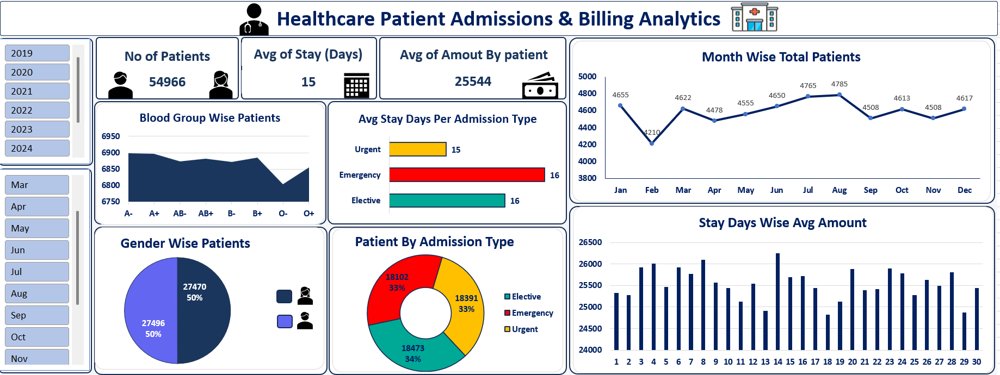

# 🏥 Healthcare Patient Admissions & Billing Analytics Dashboard

An interactive Microsoft Excel dashboard designed to monitor inpatient admission trends, healthcare billing distributions, and clinical stay metrics across 54,000+ patient records.

---

## 📊 Dashboard Preview

---

## 🎯 Business Problem & Analytical Purpose

Hospital management and clinical operational teams require visibility into patient inflow, admission pathways, and average length of stay (LOS) to optimize bed occupancy and financial forecasting. 

This project explores:
1. **Admission Dynamics:** How do patient admissions vary month-over-month and year-over-year?
2. **Operational Load:** Does patient stay duration significantly vary between emergency, elective, and urgent admissions?
3. **Financial Metrics:** How is the average billing amount distributed against patient stay durations?
4. **Demographic Balance:** What are the demographic distributions across gender and blood groups?

---

## 📈 Key Insights & Summary

* **Inpatient Volume:** Evaluated **54,966** total patient admissions.
* **Length of Stay (LOS):** The hospital maintains an overall average stay of **15 days**, with minimal variance across admission types (Emergency: 16 days, Elective: 16 days, Urgent: 15 days).
* **Average Patient Billing:** The average billing amount is **25,544** per patient admission.
* **Seasonal Admissions:** Admission volume consistently dips in February (~4,200) and peaks during the summer months (July–August at ~4,800).
* **Demographics:** Patient admission distribution by gender is evenly balanced (Male: 27,496 vs. Female: 27,470).

---

## 🛠️ Excel Skills & Features Demonstrated

* **Data Cleaning & Formatting:** Validated data types, formatted currency and dates, eliminated redundant spaces, and verified categorical uniformity,ColumnTransformation, Remove Duplicates.
* **Calculated Columns:** Computed **Length of Stay (Days)** (`Discharge Date - Admission Date`) and extracted calendar components.
* **Pivot Tables & Metrics:** Aggregated patient counts, averages, and dynamic percentages using custom summaries.
* **Dynamic Slicers:** Implemented multi-select timeline slicers for **Year (2019–2024)** and **Month (Jan–Dec)** connected via multi-pivot report connections.
* **Visual Hierarchy:** Applied structured card designs, custom palette theming, KPI summary metric cards, and cleaned chart layout elements.

---

## 📂 Project Structure
├── healthcare_Analysis_Dashboard.xlsx   # Main interactive Excel workbook
├── Healtcare_analysis_dashboard.png # High-resolution screenshot of the dashboard
└── README.md                             # Project documentation
